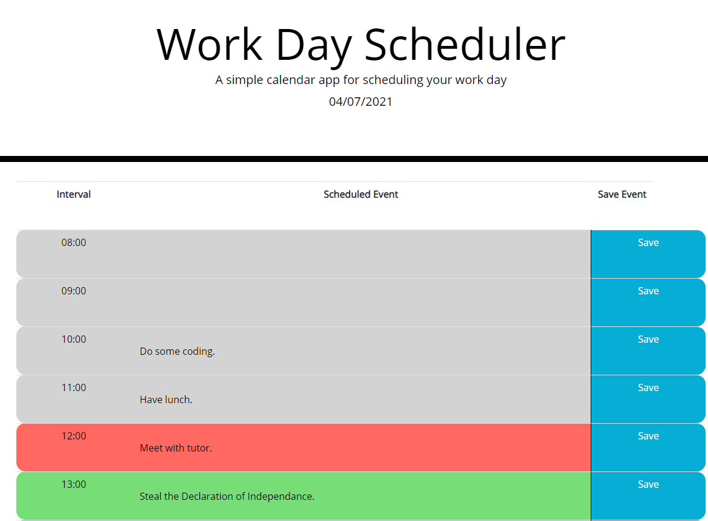

# Work Day Planner

## Description

[https://cleggatron.github.io/Work-Day-Planner/](https://cleggatron.github.io/Work-Day-Planner/)

This webpage is a dayplanner that allows users to schedule events within hour intervals within a working day (e.g 08:00 - 09:00).

When the save button is clicked the event will be stored within local storage. 

This can be cleared using the clear schedule button at the bottom. This will also erase all the events in local storage.

The interval times are colour coded. Grey represents the past events. Red is the current time interval. Green is the future.

The page has a built in auto refresh to update the time colors. This will trigger once an hour from time of page loading.

The webpage uses moment.js to handle it's time use. The layout is done with Bootstrap. We are also using jQuery to handle selection and DOM traversal.

## Installation

As this is a webpage there should not be any issue regarding installation. THe page brings through the external dependancies from external links(jQuery, Bootstrap, Moment.js). 

Bear in mind that the tasks will be stored in the local storage of your browser.

## Usage

The user types content into the "Scheduled Event" input field for the relevant interval, then clikcs save.

This saves the file in local storage meaning it will be available on reloading. 

If the user wants to clear everything (say for starting the following day), they can click the clear button at the bottom. If they wish to remove a single line they need to overwrite the individual input field and save.

## Credits

I have used the Bootstrap, jQuery, and Moment libraries in building this project.

## License
Copyright (c) [2021] [David Clegg]

Permission is hereby granted, free of charge, to any person obtaining a copy of this software and associated documentation files (the "Software"), to deal in the Software without restriction, including without limitation the rights to use, copy, modify, merge, publish, distribute, sublicense, and/or sell copies of the Software, and to permit persons to whom the Software is furnished to do so, subject to the following conditions:

The above copyright notice and this permission notice shall be included in all copies or substantial portions of the Software.

THE SOFTWARE IS PROVIDED "AS IS", WITHOUT WARRANTY OF ANY KIND, EXPRESS OR IMPLIED, INCLUDING BUT NOT LIMITED TO THE WARRANTIES OF MERCHANTABILITY, FITNESS FOR A PARTICULAR PURPOSE AND NONINFRINGEMENT. IN NO EVENT SHALL THE AUTHORS OR COPYRIGHT HOLDERS BE LIABLE FOR ANY CLAIM, DAMAGES OR OTHER LIABILITY, WHETHER IN AN ACTION OF CONTRACT, TORT OR OTHERWISE, ARISING FROM, OUT OF OR IN CONNECTION WITH THE SOFTWARE OR THE USE OR OTHER DEALINGS IN THE SOFTWARE.
